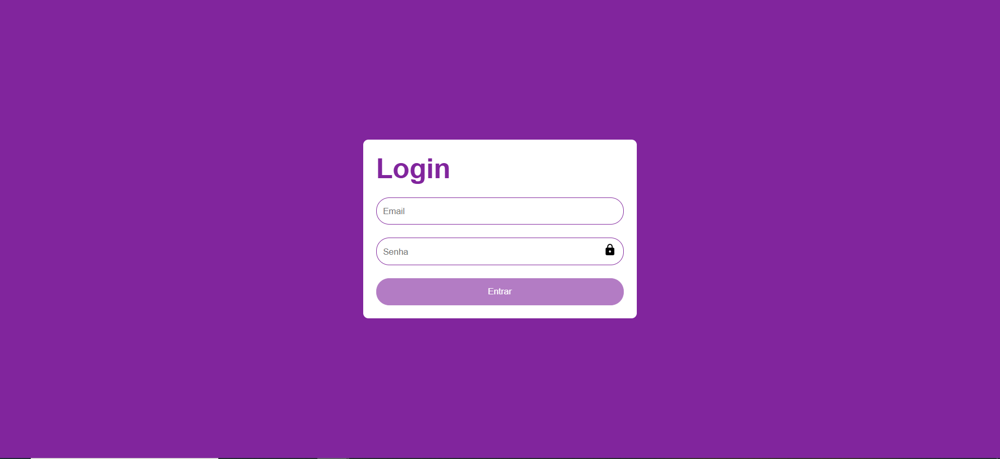
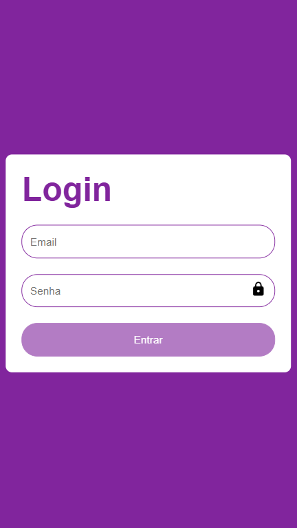

# Tela de login usando TypeScript

Este é um projeto da formação React Developer da DIO, ele consiste em criar uma tela de login usando TypeScript implementando uma etapa de autenticação e validação dentro do React. Este projeto é totalmente responsivo podendo ser acessado tanto do computador como da smartphone.

## Bibliotecas Utilizadas no projeto:

Para este projeto foi ultilizado as seguintes bibliotecas:

### `styled-components`

Esta biblioteca foi utilizada para fazer as estilização dos componentes das páginas.

### `react-icons`

Esta biblioteca foi utilizada para adicionar alguns icones as páginas.

### `react-hook-form`

Esta biblioteca foi utizada para manipular as informação do formulário.

### `@hookform/resolvers` e `yup`

Estas bibliotecas foram responsáveis pela validação dos campos dos formulários.

## Scripts disponíveis:

No diretório do projeto, você pode executar:

### `npm install`

Instala todas as dependências do projeto.

### `npm start`

Executa o aplicativo no modo de desenvolvimento. Abra [http://localhost:3000](http://localhost:3000) para visualizá-lo no seu navegador. A página será recarregada quando você fizer alterações. É possível ver erros de lint no console.

### `npm run build`

Cria o aplicativo para produção na pasta `build`. Ele agrupa corretamente o React no modo de produção e otimiza a compilação para o melhor desempenho. A compilação é minificada e os nomes dos arquivos incluem os hashes. Seu aplicativo está pronto para ser implantado!

## Design do projeto no Desktop:

Tela Home

## Design do projeto no Mobile:

Tela Home
